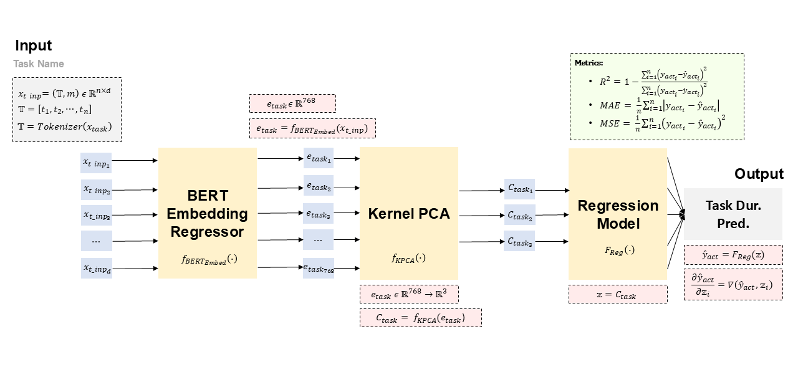
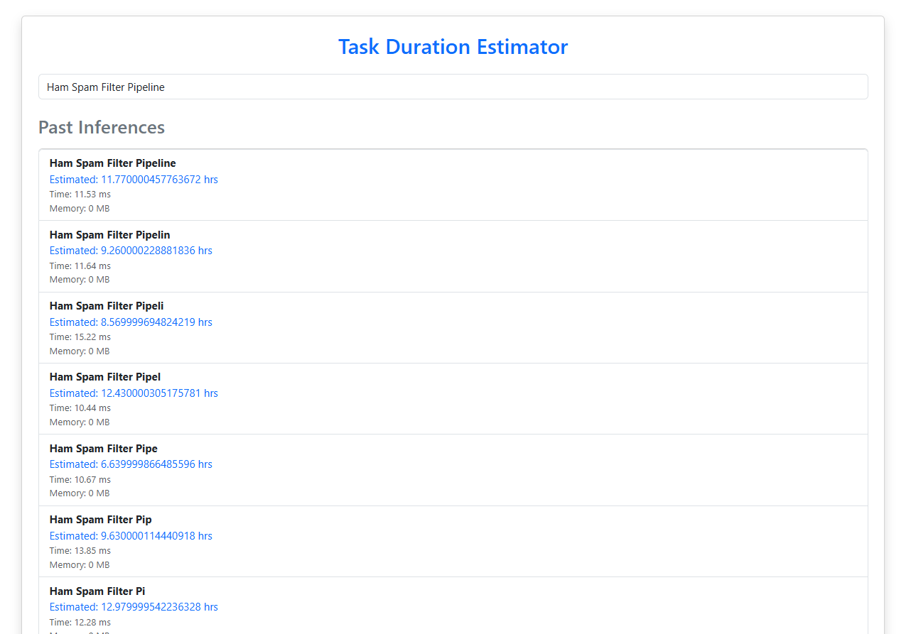

# AI Task Estimation System

This project implements a deep learning pipeline for **task duration prediction** based on task name embeddings. It combines **transformer-based encoding**, **dimensionality reduction**, and **regression modeling** to estimate the time required to complete various tasks — useful in project planning, software engineering estimation, and operations forecasting.

---

## Architecture Overview




The system follows a 3-stage pipeline:

1. **BERT Embedding Regressor**  
   Task names are tokenized and passed through a pretrained BERT model (`MiniLM` or similar) to generate fixed-length semantic embeddings.

2. **Kernel PCA**  
   These 768-dimensional embeddings are projected to a lower-dimensional latent space using Kernel PCA (nonlinear dimensionality reduction) to emphasize variance relevant for regression.

3. **Regression Model**  
   A regressor (e.g., XGBoost, Bi-LSTM, or MLP) maps the transformed embeddings to predicted task durations.

Evaluation metrics include:
- Coefficient of Determination \( R^2 \)
- Mean Absolute Error (MAE)
- Mean Squared Error (MSE)

---

## Project Structure
├── backend/ # Django backend for APIs
├── frontend/ # Vue.js or React app for UI
├── inference_server/ # FastAPI/Flask server for model inference
├── Bert_Embedding_Fine_Tuning.ipynb
├── Task_Estimation_from_BertEmb.ipynb
├── [TESTING]Task_Estimation_from_KernelPCA3d_....ipynb
├── PLAN6.png # Model architecture diagram
├── .gitignore
├── README.md
└── requirements.txt

```bash
git clone https://github.com/zencordia4913/AI_Task_Estimation_System.git
cd AI_Task_Estimation_System

